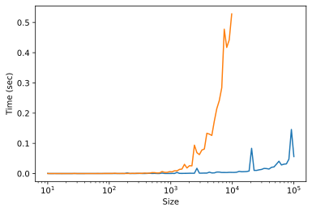

1. How does Hadamard Product (element-wise product) differ from Matrix Multiplication?

Hadarmard product performs multiplication between corresponding elements of the two tensors of identical shape (or via broadcasting over singleton dimensions). The output of the Hadamard product is the same as the input tensor. In contrast, matrix multiplication always multiply and therefore combine over the last dimension of the former matrix and the leading dimension of the latter matrix. The result of matrix multiplication is not the same as that of the input.

2. Implement matrix multiplication between a matrix of size `(5, 4)` and a matrix of size `(4, 3)` using for-loop. What is the time complexity of this implementation? Compare the performance of this implementation with NumPy's `np.matmul` function.

```python
import numpy as np

def matmul_for_loop(x, y):
    # assuming x and y are 2 dimensional
    output = []
    for x_row in x: # x row
        output.append([])
        for y_col in np.transpose(y):
            res = 0
            for ii in range(len(x_row)):
                res += x_row[ii] * y_col[ii]
            output[-1].append(res)

    return output
```

Let us denote the shape of `x` as `(M, K)` and shape of `y` as `(K, N)`. Since we are looping over the rows of `x` and columns of `y`, while performing multiplication and summation over the two inner dimensions, the overall time complexity is $O(MNK)$. Performance using `%timeit`:

```python
import numpy as np
x = np.random.rand(5, 4)
y = np.random.rand(4, 3)

%timeit x @ y # 652 ns ± 28.4 ns per loop (mean ± std. dev. of 7 runs, 1,000,000 loops each)
%timeit matmul_for_loop(x, y) # 15.7 µs ± 292 ns per loop (mean ± std. dev. of 7 runs, 100,000 loops each)
```

3. Suppose we have the following matrices

```python
import numpy as np
import torch
A = np.arange(20).reshape(5, 4)
B = torch.arange(12).reshape(4, 3)
```

What would happen in the operation `A @ B`?

`A @ B` performs the matrix multiplication between the matrix `A` and `B` among the two inner dimensions, resulting a matrix of shape `(5, 3)`.

4. Use `einsum` to implement a tensor multiplication between a tensor of shape `(5, 4, 3)` and a tensor of shape `(3, 4, 2)`, so that the resulting shape of the output is `(5, 4, 4, 2)`. Here, we treat the first dimension of the first tensor as the batch dimension, and the last dimension of the second tensor as the batch dimension as well. That is, we would like to do batch-wise matrix multiplication between pairs of matrices of shape `(4, 3)` and `(3, 4)`.

```python
import numpy as np
x = np.random.rand(5, 4, 3)
y = np.random.rand(3, 4, 2)

z = np.einsum("ijk,klm->ijlm", x, y)
```


5. Implement the same operations as above using `tensordot` instead.

```python
import numpy as np
x = np.random.rand(5, 4, 3)
y = np.random.rand(3, 4, 2)

z = np.tensordot(x, y, axes=[(2), (0)])
```


6. Compare the performance of `faster_cross_corr` with `np.corrcoef`. Plot the time taken for each function as a function of the size of the input.

```python
import time
import numpy as np
import matplotlib.pyplot as plt
from tqdm import tqdm
# TODO: import faster_cross_corr

time_taken1 = []
time_taken2 = []
sizes = np.logspace(1, 5, num=100, base=10, dtype=int)
for ii in tqdm(sizes):
    x = np.random.randn(100, ii)
    y = np.random.randn(100, 15)
    tnow = time.time()
    faster_cross_corr(x, y)
    time_taken1.append(time.time() - tnow)

    if ii > 10_000:
        continue
    tnow = time.time()
    np.corrcoef(x, y, rowvar=False)[:ii, ii:]
    time_taken2.append(time.time() - tnow)

fig, ax = plt.subplots(1, 1)
ax.plot(sizes[:len(time_taken1)], time_taken1, label="faster_cross_corr")
ax.plot(sizes[:len(time_taken2)], time_taken2, label="np.corrcoef")
ax.set_xlabel("Size")
ax.set_ylabel("Time (sec)")
ax.set_xscale("log")
fig.savefig("./Cross-Corr.svg", dpi=300, bbox_inches="tight")
```




7. What is the difference between inverse and Penrose-Moore pseudo-inverse? Illustrate the difference in results given a random square matrix to be inverted.


8. Use Singular Value Decomposition (SVD) to perform Principal Component Analysis (PCA) on the following data points. Plot the main axes of the components.

```python
import numpy as np
x  = np.random.multivariate_normal(
    mean=[-1, 1], 
    cov=[[0.2, 0.6], [0.6, 0.2]], 
    size=5000
)
```

9. Implement double-exponential curve fitting as described by the book "Regressions et Equations Integrale".
10. Try to fit the following data points using the double-exponential curve fitting method.

```python
import numpy as np
x = np.random.rand(500) * 10
x = np.sort(x)
Y = 0.2 * np.exp(-3 * x) + 0.9 * np.exp(-0.5 * x) + 0.05 * np.random.randn(500)
```