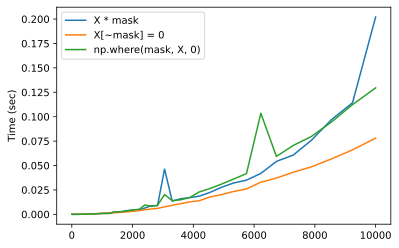

1. Implement one-hot encoding in NumPy using `np.eye`, given the inputs `num_values` and `index`.

```python
import numpy as np

def onehot(index, num_values):
	return np.eye(num_values)[index]
```

2. Construct a upper triangular mask that is two entries above the diagonal of a 7x7 matrix.

```python
import numpy as np
mask = np.ones((7, 7), dtype=bool)
mask = np.triu(mask, k=2)
```

3. Compare the performance of boolean vs. multiplication method of applying a mask to a set the diagonal entries of a 2D matrix to zero. Let `X` be a large square matrix and `mask` be the non-diagonal entries of the matrix, which can either be a boolean value or a 0/1 value. Use the `time` package to compare the performance of `X[~mask] = 0` vs. `X * mask` vs. `np.where(mask, X, 0)`. Make a plot of the matrix size vs. the time it takes to apply the mask.


```python
import time
import numpy as np
import matplotlib.pyplot as plt

sizes = np.logspace(0.6, 4, 100, dtype=int)
sizes = np.unique(sizes)

boolean_time = []
float_time = []
where_time = []

for size in sizes:
    X = np.random.rand(size, size)
    mask = np.ones_like(X)
    np.fill_diagonal(mask, 0)
    # float time
    tnow = time.time()
    X * mask
    float_time.append(time.time() - tnow)
    
    # where time
    mask = mask.astype(bool)
    tnow = time.time()
    np.where(mask, X, 0)
    where_time.append(time.time() - tnow)
    
    # boolean time
    tnow = time.time()
    X[~mask] = 0
    boolean_time.append(time.time() - tnow)
    
# Plot
fig, ax = plt.subplots(1, 1)
ax.plot(sizes, float_time, label="X * mask")
ax.plot(sizes, boolean_time, label="X[~mask] = 0")
ax.plot(sizes, where_time, label="np.where(mask, X, 0)")
ax.legend()
ax.set_label("Input Size")
ax.set_ylabel("Time (sec)")
```




4. Implement `XOR` using combinations of `AND` (`&`), `OR` (`|`) and `NOT` (`~`), i.e. `a ^ b = (a | b) & ~(a & b)`, given `a` and `b` are boolean tensors with identical shape.

```python
import numpy as np

def xor_alternative(a, b):
	ab_or = np.logical_or(a, b)
	ab_and = np.logical_and(a, b)
	# xor
	return np.logical_and(ab_or, np.logical_not(ab_and)) 
```

5. Use `combine_mask` to merge the following two masks with `OR` operation.

```python
mask1 = np.array([[1, 0, 0], [0, 1, 0], [0, 0, 1]])
mask2 = np.array([[0, 0, 1], [0, 1, 0], [1, 0, 0]])
```

```python
import numpy as np
# TODO: import combine_mask

mask1 = np.array([[1, 0, 0], [0, 1, 0], [0, 0, 1]])
mask2 = np.array([[0, 0, 1], [0, 1, 0], [1, 0, 0]])

combine_mask(mask1, mask2, operation="or")
# array([[1, 0, 1],
#        [0, 1, 0],
#        [1, 0, 1]])
```

6. Compute the average of the top-3 values of each row of the following matrix: `[[0.6, 0.3, 0.7, 0.9, 0.8, 0.4], [0.1, 0.2, 0.3, 0.5, 0.4, 0.8]]` (Hint: use `top_k_masking` to mask out all but the top 3 values, then sum together each row and divide by 3).

```python
import numpy as np
# TODO: import top_k_masking

mat = np.array([
	[0.6, 0.3, 0.7, 0.9, 0.8, 0.4],
	[0.1, 0.2, 0.3, 0.5, 0.4, 0.8]
])
masked_mat = top_k_masking(mat, top_k=3)
mat_avg = masked_mat.sum(axis=1) / 3
# array([0.8       , 0.56666667])
```

7. Pad the rows of the following matrix with average of the row using NumPy's `np.pad` method, to 5 entries each row. `[[1, 5, 2, 4], [6, 3, 8, 7]]`.

```python
import numpy as np
arr = np.array([[1, 5, 2, 4], [6, 3, 8, 7]])
arr = np.pad(arr, [[0, 0], [0, 1]], mode="mean")
# array([[1, 5, 2, 4, 3],
#        [6, 3, 8, 7, 6]])
```

8. Apply `align_lengths` to the following data

```python
X = np.array([[1, 2, 3], [4, 5, 6]])
y = np.array([[1, 2, 3, 4, 5, 6], [1, 2, 3, 4, 5, 6]])
```

and

```python
X = np.array([[1, 2, 3], [4, 5, 6]])
y = np.array([[1, 2], [1, 2]])
```

```python
import numpy as np
# TODO: import align_lengths

X = np.array([[1, 2, 3], [4, 5, 6]])
y = np.array([[1, 2, 3, 4, 5, 6], [1, 2, 3, 4, 5, 6]])
z = align_lengths(X, y)
# array([[1, 2, 3],
#        [1, 2, 3]])

X = np.array([[1, 2, 3], [4, 5, 6]])
y = np.array([[1, 2], [1, 2]])
z = align_lengths(X, y)
# array([[1, 2, 0],
#        [1, 2, 0]])

```


9. Apply softmax to the array `[0.5, 0.8, -1e9, 0.7]`. What is the value of the third entry after softmax activation? Consider why we need to use a large negative number as the masked value, instead of setting the masked value to zero after softmax. Discuss pros and cons of each approach.

After softmax activation, the third entry becomes a value near zero. This is a trick for masking values before softmax activaiton, such that after softmax activation, the sum of all entries are still close to 1. If we mask to zero before hand, and then take softmax, then the masked values will no longer be 0 (i.e. 0.5 instead). If we then mask these values again to zero, then the rest of the entries will no longer sum to 1.0.


10. Consider the function `ragged_range` that we implemented in this chapter. Suppose the input `n = [5, 2, 3, 1000]`, where the last array has length significantly greater than that of the rest. What would happen in this case? What is the maximum memory that would be used when creating the ragged range array?

In the intermediate step of creating the variable length list, we will create a matrix of shape `(4, 1000)`, where rows index 0 to 2 will only have several valid entries. This can consume a large amount of memory if our batch size is larger, i.e. having more rows of data. In later chapters, we will introduce more efficient way to implement this function.
