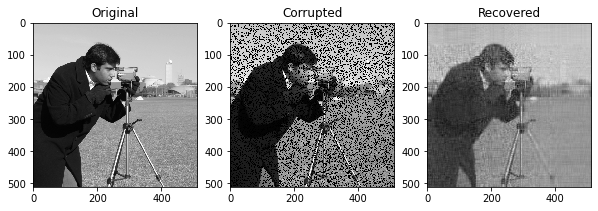

1. What are the differences between a sparse matrix/tensor and a dense matrix/tensor?

Sparse matrices are matrices with empty entries that are not filled with any data in the memory. Depending on the specific format, they use coordinates to represent the locations of the data within the matrix. In contrast, dense matrix has a specific shape where all its entries are filled with some value in the memory.

2. Given the following row, col, and data arrays, create a `csr_matrix` (Hint: starts with a `coo_matrix`):

```python
import numpy as np
row = np.array([0, 0, 1, 2, 2, 2])
col = np.array([0, 2, 1, 3, 4, 6])
data = np.array([1, 2, 3, 4, 5, 6])
shape = (4, 8)
```

```python
import numpy as np
from scipy.sparse import coo_matrix
row = np.array([0, 0, 1, 2, 2, 2])
col = np.array([0, 2, 1, 3, 4, 6])
data = np.array([1, 2, 3, 4, 5, 6])
shape = (4, 8)

mat = coo_matrix((data, (row, col)), shape=shape)
mat = mat.to_csr()
```

3. Compare memory usage of the dense and sparse representations of the following matrix:

```python
import numpy as np
from scipy.sparse import coo_matrix
A = np.random.randint(1, 10, size=(1000, 1000), dtype=int)
A[A < 8] = 0
A_sp = coo_matrix(A)
```

To find out the total bytes of a NumPy array, use `A.nbytes`. Similarly, to find out the total bytes of a sparse matrix, use `A_sp.data.nbytes + A_sp.row.nbytes + A_sp.col.nbytes`.


The dense matrix occpies 8 MB of memory, while the sparse matrix occupies 3.5 MB of memory.


4. Compare the memory usage of the dense and sparse representation of the following matrix

```python
import numpy as np
from scipy.sparse import coo_matrix
B = np.random.randint(1, 10, size=(1000, 1000), dtype=int)
B[B < 1] = 0
B_sp = coo_matrix(B)
```

Together with Question #3, readers can get a sense when sparse matrix is (or is not) more memory efficient than dense matrix.


In this question, the dense matrix `B` has the same size as `A` in the previous question, which occupies 8 MB of memory. However, the sparse version occupies 16 MB of memory, more than the dense representation. This pair of questions intend to illustrate the discussion we had in this chapter on when not to use sparse representations.


5. Add each row of the following matrix by the number of non-zero elements. Hint: using column-wise broadcasting and `.getnnz` method.

```python
X = np.array([
    [1, 2, 0, 3, 0],
    [0, 2, 0, 1, 0],
    [2, 5, 3, 4, 0],
    [0, 3, 0, 0, 1],
    [0, 1, 0, 0, 2]
])
```

```python
import numpy as np
from scipy.sparse import coo_matrix
# TODO: import R_plus_cv

X = np.array([
    [1, 2, 0, 3, 0],
    [0, 2, 0, 1, 0],
    [2, 5, 3, 4, 0],
    [0, 3, 0, 0, 1],
    [0, 1, 0, 0, 2]
])

X = coo_matrix(X)
nnz = X.getnnz(axis=1)

y = R_plu_cv(X, nnz)

# array([[4, 5, 0, 6, 0],
#        [0, 4, 0, 3, 0],
#        [6, 9, 7, 8, 0],
#        [0, 5, 0, 0, 3],
#        [0, 3, 0, 0, 4]])
```


6. Write a function that can convert Scipy's `coo_matrix` into `tf.SparseTensor`.

```python
import tensorflow as tf

def scipy_to_tf_sparse(mat):
    mat = mat.tocoo()
    indices = tf.stack([mat.row, mat.col])
    indices = tf.transpose(indices)
    indices = tf.cast(indices, tf.int64)
    return tf.SparseTensor(
        indices=indices,
        values=tf.constant(mat.data),
        dense_shape=mat.shape,
    )
```


7. Use `tf.sparse.reduce_max` to find out the maximum value of each row of the following sparse tensor, given in its dense representation (0s as the sparse entries; use `tf.sparse.from_dense` to convert the dense representation to sparse representation`):

```python
X = tf.constant([
    [1, 2, 0, 3, 0],
    [0, 2, 0, 1, 0],
    [2, 5, 3, 4, 0],
    [0, 3, 0, 0, 1],
    [0, 1, 0, 0, 2]
])
```

```python
import tensorflow as tf
X = tf.constant([
    [1, 2, 0, 3, 0],
    [0, 2, 0, 1, 0],
    [2, 5, 3, 4, 0],
    [0, 3, 0, 0, 1],
    [0, 1, 0, 0, 2]
])
X = tf.sparse.from_dense(X)

tf.sparse.reduce_max(X, axis=1)
# <tf.Tensor: shape=(5,), dtype=int32, numpy=array([3, 2, 5, 3, 2], dtype=int32)>
```

8. Construct a PyTorch coo sparse tensor using the following indices. Then convert to a csr sparse tensor.

```python
row = [0, 0, 0, 0, 1, 1, 1]
col = [0, 1, 3, 5, 1, 2, 4]
data = [1, 2, 3, 4, 5, 6, 7]
shape = (3, 10)
```

```python
import torch
row = [0, 0, 0, 0, 1, 1, 1]
col = [0, 1, 3, 5, 1, 2, 4]
data = [1, 2, 3, 4, 5, 6, 7]
shape = (3, 10)

# build coo matrix
coo_sparse = torch.torch.sparse_coo_tensor(
    indices=[row, col],
    values=data,
    size=shape,
    dtype=torch.int32,
).coalesce()

csr_sparse = coo_sparse.to_sparse_csr()
```

9. Tune Alternating Least Squares (ALS) model on the MovieLens dataset. How is the latent feature size `K` and regularization term `l2_reg` trading off?

Increasing `K` increase modeling power, and therefore makes the model more prone to overfit. Increasing `l2_reg` provides more regularization to the model and prevents model from overfitting.

10. Use ALS for image completion.

```python
import numpy as np
import scipy.sparse
from scipy.sparse import csc_matrix, coo_matrix
from tqdm import tqdm
from pdb import set_trace

import os
import skimage # pip install scikit-image==0.22.0
from skimage import io
import matplotlib.pyplot as plt
import pandas as pd

# TODO: import regularized_matrix_factorization

X = skimage.data.camera()
R = X.flatten()
# randomly corrupt the image
rs = np.random.RandomState(42)
index = rs.choice(len(R), size=int(len(R)*0.25), replace=False)
R[index]=0
R = R.reshape([512, 512])

# Run through ALS
U, W, b, c, mu, J, R_hat = regularized_matrix_factorization(
    csc_matrix(R).astype(float), K=25, l2_reg=1E-9, maxiter=25
)

R_hat = U @ W.T + b[:, np.newaxis] + c[np.newaxis, :] + mu


# Plot
fig, axs = plt.subplots(1, 3, figsize=(10,4))
ax = axs[0]
ax.imshow(X, cmap='gray', interpolation='none')
ax.set_title("Original")
ax = axs[1]
ax.imshow(R, cmap='gray', interpolation='none')
ax.set_title("Corrupted")
ax = axs[2]
ax.imshow(R_hat, cmap='gray', interpolation='none')
ax.set_title("Recovered")
```



